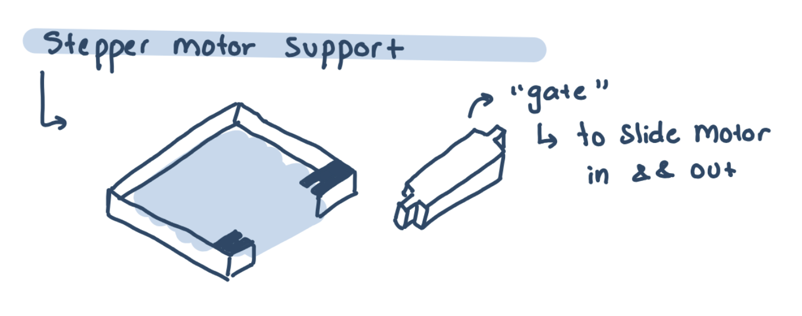
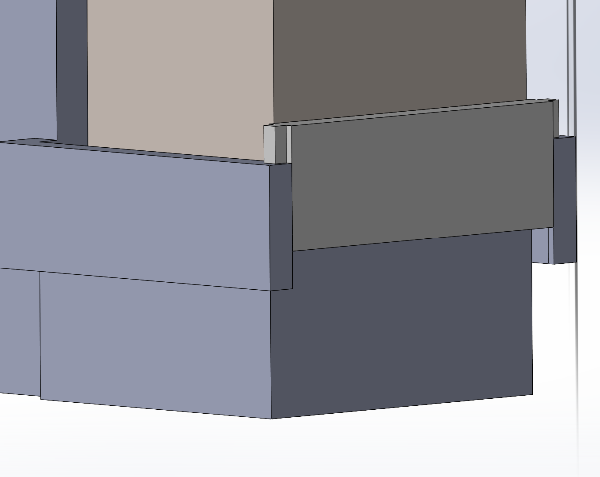
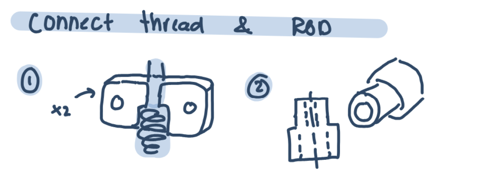
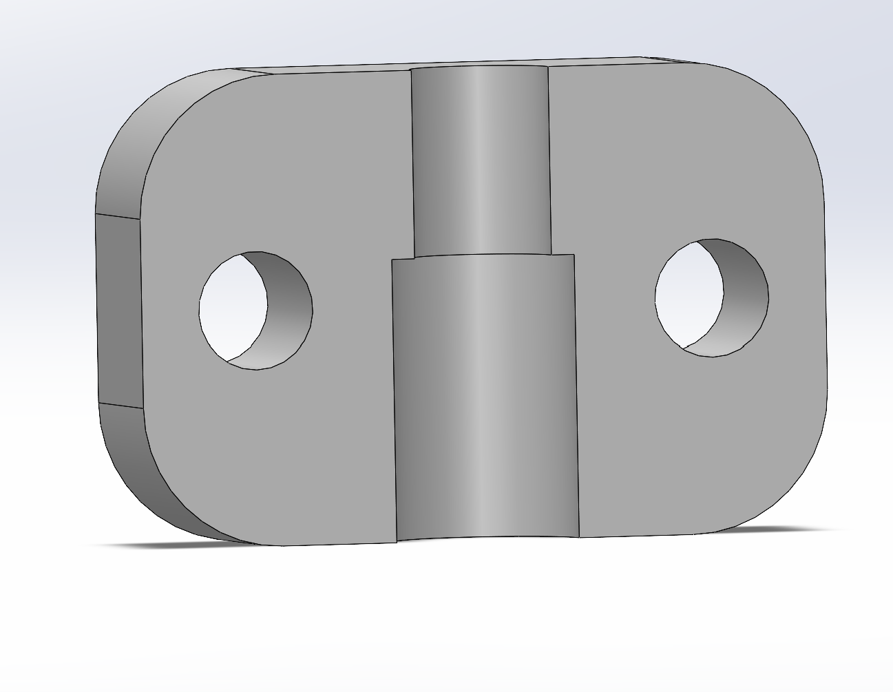
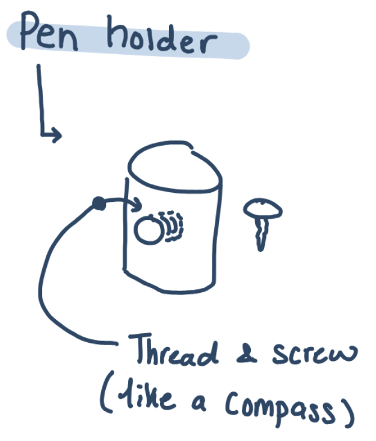
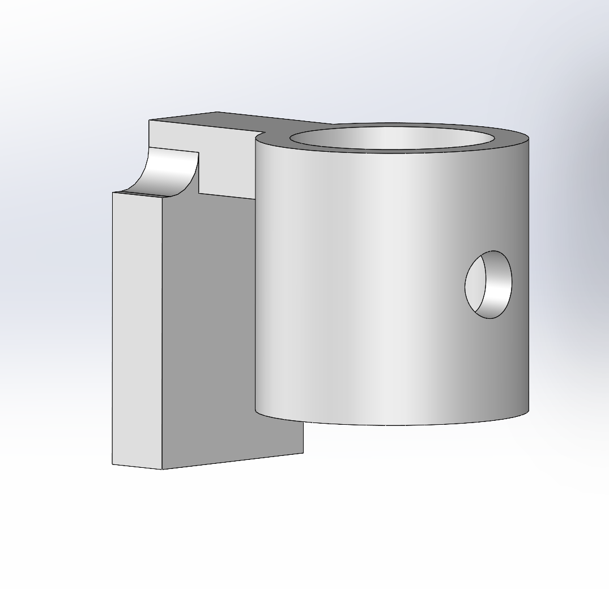

# Current Progress

  ### WORK DONE FOR BASIC CHASSIS:
  ----------------------------------

  The project started off as a basic pen plotter. The following showcases the main steps I took to create a full SolidWorks assembly of its structure.

### 1. Movement:

  I began this project by planning the movement of the pen. Since the machine needed to draw, incorporating both the x and y axes was obvious. Likewise, adding a z-axis to lift and lower the pen onto the paper was essential. However, I needed to consider the displacement required for each axis. To keep things simple, I decided the machine should be capable of drawing anywhere on a standard 8.5 by 11-inch sheet of paper. For the z-axis, I chose a 1 cm range, which would provide enough clearance for brushes to create varying thicknesses if I decided to include that feature.
    
  With the basic concept established, I considered different ways to achieve movement. Having previous experience with CNC machines and having designed parts for one myself, I opted for a standard thread and nut, as my experience with these has been straightforward and reliable. Keeping this in mind, I started sketching how I envisioned the machine operating. An early-stage sketch can be seen below:

  

  Later on, I updated these sketches to be a bit more clear and showcase each axis individually:

  

The general idea was that each axis would be controlled by 1-2 stepper motors, be moved through thread and nuts, and have two support beams to keep them in place.

### 2. Design of each axis:

  With a general idea of how I wanted the machine to operate, I began to do some work in CAD and assemble each of the axis individually. I played around with different sizes and shapes, aiming to make the machine as small as possible. The biggest change between the initial sketches and their new CADS was the removal of one of the support rods. This was done as I had found that everything was relatively light enough that one support rod could suffice (I did add an extra one for the right side of the y axis since the stepper motor would weight it down on one side). CADS of each assembly for the Z,X, and Y axis could be seen below:

   **********ADD THE CADS BELOW EACH ************

  

  Assembly of the X axis

  

  Assembly of the Y axis (left side)

  

  Assembly of the Y axis (Right side)

  

  Assembly of the Z axis (Note: The piece that connects the thread and shaft only shows half of it for visibility reasons)

### 3. Assmebly

 Once I had each individual axis assembled, I began to piece it all together in one big assembly, making any necessary changes to ensure a proper fit. A close up of how each axis fit can be seen below:

  

  Example image of how the axis connect with one another

  

  Example image of how the axis connect with one another and the inside structure

Hopefully it's not too hard to see above, but for a quick explanation: The Z axis moves along the x axis which is being supported by two bases, both of which move alone the y axis. (This is more clear in the image of the full assembly below)

   Once it all fit smoothly, I did some calculations for how large to make the rods, threads, and the overall base of the structure (This did change later on when I decided to add the watercolour attachment). With the sizing determined, an assembly was created:

  

  Full assembly of the basic chassis

  

  Full assembly of the basic chassis with view of the inside structure

  ### 4. Attachments/Extra Features

  Other parts had to be made as well in order to ensure everything fit nicely.

  For instance, I designed and modeled a holder for the stepper motors. I realized that with a normal box support, it would be very difficult to assemble the stepper motor with the thread and rod. For this reason, I added a little "gate" that allows you to freely slide the motor in and out. A sketch and its CAD can be seen below:

  

  Sketch of stepper motor support design

  

  CAD of stepper motor support

I also had two different designs for a part that could hold the shaft of the motor to the threaded rod. Both designs and models can be seen below and both were incorporated into the final design:

  

  Sketches of both design ideas to connect motor shaft and thread

  

  CAD of thread and shaft connector V1 (one half)

  

  CAD of thread and shaft connector V2

The final attachment was a simple design to hold the pen/brush in place. Inspired by a compass, this attachement useses a screw and thread to tighten and hold it:

  

  Sketch of pen holder design

  

  CAD of pen holder

### WORK DONE FOR THE WATERCOLOUR COMPONENT:
------------------------------------------------

To add depth and more complexity to this project, I decided to challenge myself to make the Pen Plotter be able to mix colours and shades through the use of water colours. Below the current work I have done to acheive this can be found:

1. Necessary Components

   I began by brainstorming what components may be needed for a machine to be able to freely use water colours. I thought back to my watercolouring days and noted that varying paints, clean water, and tissue paper was necessary in order to have untainted colours of varying shades while painting. An initial sketch of how these elements could be incoportaed are found below:

   (Sketch)

From here, I realized one big issue. Unless there was human interferance with the machine as it operated, the water used to mix the watercolours would be murky and not allow the colours to mix nicely. A solution to this? A flushing system. 

2. Flushing System

   I took inspiration from other flushing systems I have seen for watercolouring. They often looked something like this:

   (add image)

  By taking it to its simplest features, I designed my own, miniscale flushing system that could be used within the CNC. A sketch and CAD of the design can be found below:

  It is a simple spring system. To prevent any leaking, I may decide to opt for a rubber tip.

(Sketch and pic)

3. Assembly of Tray

   (wip)

4. Assmebly to entire CNC chassis

   (wip)
