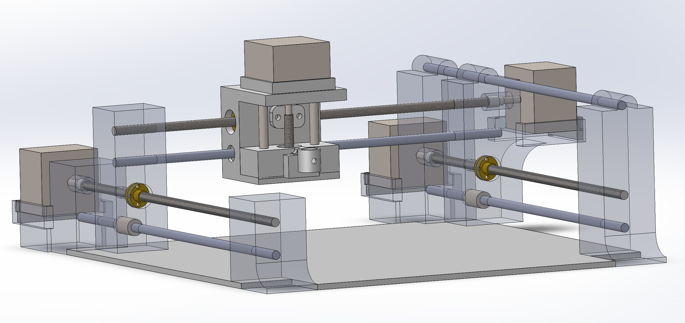

# Watercolour_Pen_Plotter
(WIP)

  

## About:
The Watercolour Pen Plotter is a CNC machine designed to operate like a traditional pen plotter but tailored for watercolor painting on traditional 8.5 x 11 paper. The goal is to create a compact, user-friendly frame with an added feature for mixing paint. The CNC machine will paint freely, blending colors and adjusting shades by varying the paint-to-water ratios through an automated process.

## Progress:
 [A detailed file describing the process can be found here](Progress.md)

Summary: 
_________________________________________________________________________________________________________________
Design:
- All components for the CNC machine have been brainstormed and designed. This was mainly done through sketches.
  
CAD:
- All CAD work has been completed for the chassis of the CNC machine on Solidworks. 

Electronics:
- Setup and tested scrap stepper motors that was found from an old machine by running G-code on CNC shield and Arduino Uno.

Work to be complete:
- Potential optimization of material use in chassis
- 3D printing and prototyping
- Running all electrical components with chassis: testing and debugging
___________________________________________________________________________________________________________________

  The design process encompassed many sketches. A full PDF of my sketches can be found here: 
  [View the file](WCPP_Design.pdf)

## CAD Models:

All SolidWork CAD models were created using SolidWorks 2023. All files for the assembly can be found in the repository.

## External Help (Parts that will be put to use):

The following parts and links are pieces that I plan to use in this project. I used their dimensions to help create my CADs.

[Linear Ball Bearings](https://www.amazon.ca/Linear-Bearing-Bushing-Bearings-Printer/dp/B07G959TX9/ref=asc_df_B07G959TX9/?tag=googleshopc0c-20&linkCode=df0&hvadid=706827341213&hvpos=&hvnetw=g&hvrand=3155492076409892794&hvpone=&hvptwo=&hvqmt=&hvdev=c&hvdvcmdl=&hvlocint=&hvlocphy=9189954&hvtargid=pla-863750415054&psc=1&mcid=83356063198b373095a54e353a229e2e&gad_source=1 )

[Thread/Brass Nut](https://www.amazon.ca/150mm%EF%BC%885-9-Inches%EF%BC%89Tr8x2-Thread-Printer-Machine/dp/B08JLHSHQ7/ref=sr_1_5?crid=342U61I1D2Z1W&dib=eyJ2IjoiMSJ9.K8yFaoKvD93vHmMWu-6dosnkI2Hc2hESDCKq_MX9UniTH5eMmlaz17-AECvAzfr8fa_tNlko94LElgOuGFR1pg6fcWvTTDkgcckrDLfGwWS8UG0s_nAbi7ZlSiZkIKOKXjpPNoiVtZpvaRJ11V6ocisPhilxNeRoQQomr4IUeATEzIMc6_8TXVi6bi3p8QAi7mgU_17RZqDUStCGY1cZNPm8Jn7m046fybx8Nv4n5sLPZOa2qYlaoLF6uuexDXtZP9xRNpqIcq5JOThz-4zYmkw-lxmnBmpaidmHJpAknTc.nwcdfs_AbFmB5oZ7mY58bLYDzkMkdjy3nAAIeM9Bnm4&dib_tag=se&keywords=thread%2Band%2Bnut%2Bcnc&qid=1724987692&s=industrial&sprefix=thread%2Band%2Bnut%2Bcnc%2Cindustrial%2C91&sr=1-5&th=1)

Stepper Motors: (Not sure right now, they were scrap motors)

(Any other parts I will update as I move along)

  ## Looking to Help Out?

If you are interested in collaborating to make this project even bigger and cooler, don't hesitate to reach out! I'd love to work with others and get different insights and perspectives.

  

  

